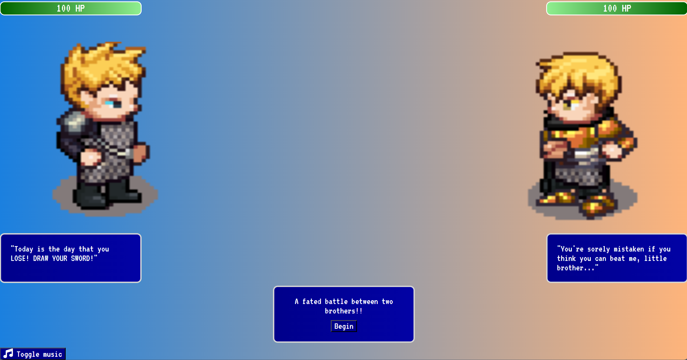

# DUEL!

 

> DUEL! is a dynamic web application designed to emulate the magic of classic RPGs. It provides a fully functional turn-based combat system reminiscent of iconic titles such as Final Fantasy and Dragon Quest. DUEL! utilizes DOM manipulation to enhance interactivity, providing players with an action menu where each button triggers a unique sequence. Additionally, there's a fully built victory sequence to celebrate winning and a game over sequence for defeats.

## Total Development Period

> 02-28-2024 ~ 03-01-2024

## Project Objectives

> - Hone Skills in JavaScript, HTML, and CSS: The primary objective of this project is to refine proficiency and gain a deeper understanding of web development technologies.
> - Learn DOM Manipulation: Become comfortable with DOM manipulation by utilizing JavaScript techniques to manipulate different attributes like 'hidden' to manage visibility and employing <i>setTimeout</i> for timing events to enhance the functionality and user experience of the application.
> - Develop Creative Styling Techniques: Explore creative approaches to styling using CSS to enhance the visual appeal and user experience of the application while also demonstrating proficiency in CSS.

## Battle Actions

> - Attack - Deals 20 damage to opponent
> - Defend - Reduces the next incoming attack by 67%
> - Magic - Heal spell restores 50 HP

## Dynamic Elements

> - Actions modify health bar signifying full to low health
> - Sprite animations changed using setTimeout
> - Different buttons shown depending on game execution
> - Toggle music button to mute or unmute audio music

## Credits

### Sprites

> Sprites by: Johannes Sjölund (wulax), Michael Whitlock (bigbeargames), Matthew Krohn (makrohn), Nila122, David Conway Jr. (JaidynReiman), Carlo Enrico Victoria (Nemisys), Thane Brimhall (pennomi), bluecarrot16, Luke Mehl, Benjamin K. Smith (BenCreating), ElizaWy, MuffinElZangano, Durrani, kheftel, Stephen Challener (Redshrike), TheraHedwig, Evert, Pierre Vigier (pvigier), Eliza Wyatt (ElizaWy), Johannes Sj?lund (wulax), Sander Frenken (castelonia), dalonedrau, Lanea Zimmerman (Sharm), laetissima, kirts, Mark Weyer, Joe White, Mandi Paugh, William.Thompsonj, Manuel Riecke (MrBeast), Barbara Riviera, thecilekli, Yamilian, Fabzy, Skorpio, Radomir Dopieralski, Emilio J. Sanchez-Sierra, kcilds/Rocetti/Eredah, Cobra Hubbard (BlueVortexGames), DCSS authors, Marcel van de Steeg (MadMarcel), DarkwallLKE, Charles Sanchez (CharlesGabriel), Shaun Williams, Tuomo Untinen (reemax), Stafford McIntyre, PlatForge project, Tracy, Daniel Eddeland (daneeklu), William.Thomsponj, Joshua Taylor, Zi Ye, AntumDeluge, drjamgo@hotmail.com, Lori Angela Nagel (jastiv), gr3yh47, pswerlang, XOR, tskaufma, Inboxninja, Dr. Jamgo, LordNeo Sprites contributed as part of the Liberated Pixel Cup project from OpenGameArt.org: http://opengameart.org/content/lpc-collection License: Creative Commons Attribution-ShareAlike 3.0 (CC-BY-SA 3.0) http://creativecommons.org/licenses/by-sa/3.0/ Detailed credits: https://github.com/joond10/turnbased-rpg/tree/main/credits

### Music

> The music used in this project is sourced from the _Final Fantasy IV Original Soundtrack_ and _Final Fantasy VIII Original Soundtrack_ albums composed by Nobuo Uematsu
> Final Fantasy IV Original Soundtrack - Suspicion
> Final Fantasy IV Original Soundtrack - Fight 2
> Final Fantasy VIII Original Soundtrack - Continue
> Final Fantasy VIII Original Soundtrack - Fanfare
