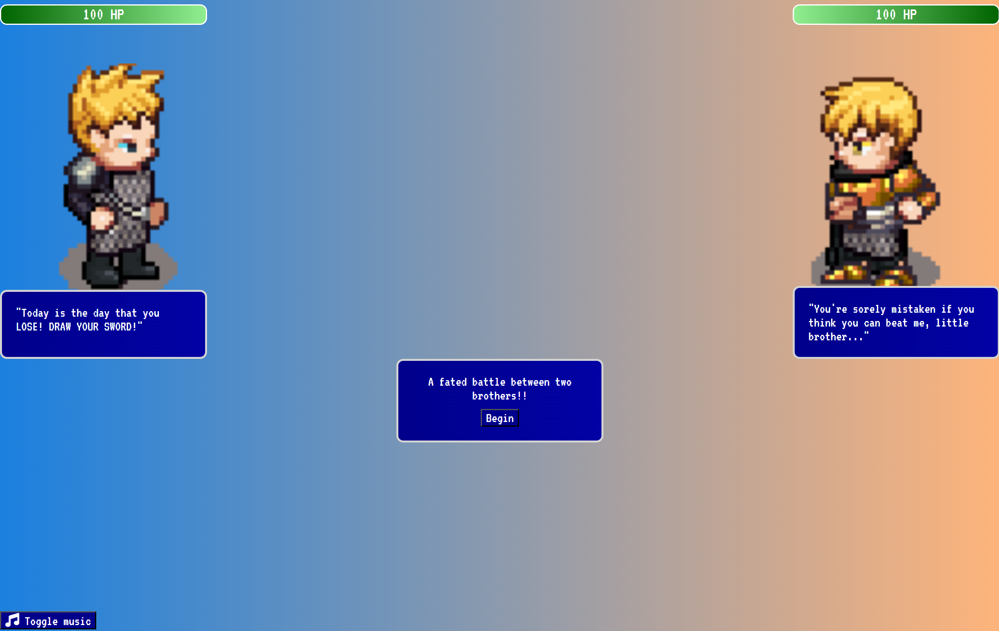
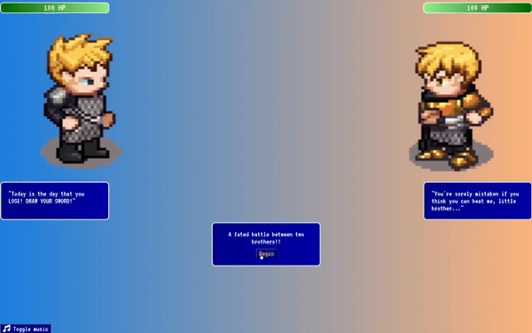
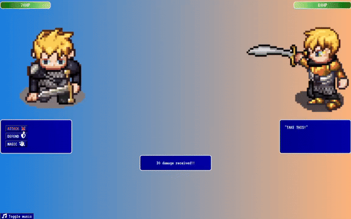

# DUEL!

 

> DUEL! is a dynamic web application designed to emulate the magic of classic RPGs. It provides a fully functional turn-based combat system reminiscent of iconic titles such as Final Fantasy and Dragon Quest. DUEL! utilizes DOM manipulation to enhance interactivity, providing players with an action menu where each button triggers a unique sequence. Additionally, there's a fully built victory sequence to celebrate winning and a game over sequence for defeats.

## Deployment

> This application is hosted on [Vercel](https://vercel.com/).
> The deployed website can be accessed [here](https://duel-rpg.vercel.app/)

## Total Development Period

> 02-28-2024 ~ 03-02-2024

## Tech Stack

  

## Project Objectives

> ### Hone Skills in JavaScript, HTML, and CSS:
>
> The primary objective of this project is to refine proficiency and gain a deeper understanding of web development technologies.
>
> ### Learn DOM Manipulation:
>
> Become comfortable with DOM manipulation by utilizing JavaScript techniques to manipulate different attributes like 'hidden' to manage visibility and employing <i>setTimeout</i> for timing events to enhance the functionality and user experience of the application.
>
> ### Develop Creative Styling Techniques:
>
> Explore creative approaches to styling using CSS to enhance the visual appeal and user experience of the application while also demonstrating proficiency in CSS.

## Battle Actions

> - **Attack** - Deals 20 damage to opponent
> - **Defend** - Reduces the next incoming attack by 67%
> - **Magic** - Heal spell restores 50 HP

## Features

> - **Health Bar Modification**: The health bar dynamically adjusts to reflect changes in health status, ranging from full to low health.
> - **Sprite Animations**: Sprite animations are controlled using `setTimeout`, enabling smooth transitions between different states.
> - **Dynamic Button Display**: Depending on the game's execution, different buttons are shown to the user, providing contextually relevant options.
> - **Information Bubbles**: Action buttons dynamically insert information bubbles, elucidating their respective functions upon interaction.
> - **Music Toggle**: Users can toggle the music on/off with the dedicated music button, offering control over the audio experience.

## Project Challenges

> - I went into this project not knowing anything about the flexbox layout model in CSS. Initially, I tried to design and develop the styling without it which proved to be difficult. In the the process, I learned about flexbox which provided a more efficient way to arrange, align, and distribute space among items in a container, even when their size is unknown or dynamic. Even then, I found it difficult to accomplish what I had in mind but I was able to successfully implement nested flexbox layouts as shown by the information displayed upon action button hover.
> - Testing my web application on various devices revealed viewport issues. Although it appeared as intended on my own device, discrepancies arose on others. To address this, I employed percentage-based dimensions for the images by wrapping them in a container and manipulating that as opposed to the images. This ensured dynamic sizing relative to the user's screen, regardless of resolution variations.

## Future Updates

> - In future updates, I plan to address the current lack of responsiveness in the project by implementing a responsive design. At present, the project does not adapt adequately to mobile viewports.
> - May implement a 2 player mode functionality of the application.

## Credits

### Sprites

> Sprites by: Johannes Sjölund (wulax), Michael Whitlock (bigbeargames), Matthew Krohn (makrohn), Nila122, David Conway Jr. (JaidynReiman), Carlo Enrico Victoria (Nemisys), Thane Brimhall (pennomi), bluecarrot16, Luke Mehl, Benjamin K. Smith (BenCreating), ElizaWy, MuffinElZangano, Durrani, kheftel, Stephen Challener (Redshrike), TheraHedwig, Evert, Pierre Vigier (pvigier), Eliza Wyatt (ElizaWy), Johannes Sj?lund (wulax), Sander Frenken (castelonia), dalonedrau, Lanea Zimmerman (Sharm), laetissima, kirts, Mark Weyer, Joe White, Mandi Paugh, William.Thompsonj, Manuel Riecke (MrBeast), Barbara Riviera, thecilekli, Yamilian, Fabzy, Skorpio, Radomir Dopieralski, Emilio J. Sanchez-Sierra, kcilds/Rocetti/Eredah, Cobra Hubbard (BlueVortexGames), DCSS authors, Marcel van de Steeg (MadMarcel), DarkwallLKE, Charles Sanchez (CharlesGabriel), Shaun Williams, Tuomo Untinen (reemax), Stafford McIntyre, PlatForge project, Tracy, Daniel Eddeland (daneeklu), William.Thomsponj, Joshua Taylor, Zi Ye, AntumDeluge, drjamgo@hotmail.com, Lori Angela Nagel (jastiv), gr3yh47, pswerlang, XOR, tskaufma, Inboxninja, Dr. Jamgo, LordNeo Sprites contributed as part of the Liberated Pixel Cup project from OpenGameArt.org: http://opengameart.org/content/lpc-collection License: Creative Commons Attribution-ShareAlike 3.0 (CC-BY-SA 3.0) http://creativecommons.org/licenses/by-sa/3.0/ Detailed credits: https://github.com/joond10/turnbased-rpg/tree/main/credits

 

### Music

> The music used in this project is sourced from the _Final Fantasy IV Original Soundtrack_ and _Final Fantasy VIII Original Soundtrack_ albums composed by Nobuo Uematsu
>
> - Final Fantasy IV Original Soundtrack - Suspicion
> - Final Fantasy IV Original Soundtrack - Fight 2
> - Final Fantasy VIII Original Soundtrack - Continue
> - Final Fantasy VIII Original Soundtrack - Fanfare
